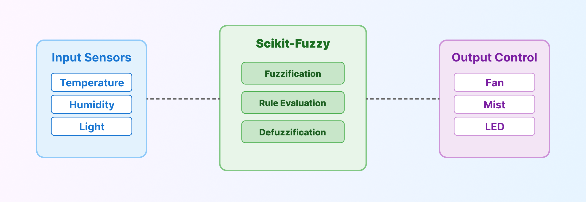
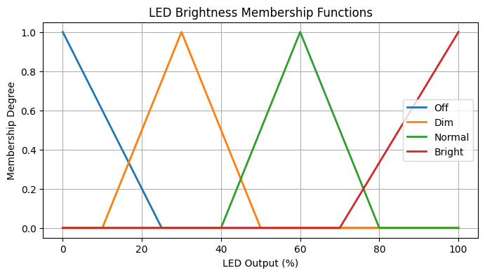

# 📘 [เวอร์ชั่นภาษาไทยที่นี่](README.md)

[](https://www.python.org/)
[](https://github.com/scikit-fuzzy/scikit-fuzzy)
[](https://github.com/morsetechlab)

# 🪴 Fuzzy Greenhouse Controller

> A Fuzzy Logic-based CLI system to control fan speed, misting, and LED brightness in greenhouses

An automatic greenhouse environmental controller powered by Fuzzy Logic.  
This system performs soft-control over temperature, humidity, and light levels using Python and Scikit-Fuzzy.  
Ideal for IoT, Smart Farming, ESP32, and Raspberry Pi deployments.

## Key Features

- Built using `Python` and `scikit-fuzzy`
- Operable via CLI (Command Line)
- Accepts real sensor input: temperature, humidity, and light
- Returns soft-control outputs (percentages, not binary)
- Optimized for ESP32, Raspberry Pi, and edge IoT systems

## System Overview

<p align="center">
  
</p>

> Sensor input (temperature, humidity, light) → Fuzzy Controller → Fan / Mist / LED signal output

## Installation

```bash
pip install -r requirements.txt
```

or manually:

```bash
pip install numpy scipy scikit-fuzzy packaging
```

## 🚀 CLI Usage

```bash
python fuzzy_greenhouse.py --temp 36.5 --hum 48 --light 120
```

### Output

```
Fuzzy Control Output:
Fan: 73.2 %
Mist: 51.8 %
LED: 93.6 %
```

## 🎛️ Membership Functions (MF)

### 🌡️ Temperature

```python
Cold   = [15, 15, 25]
Medium = [20, 30, 40]
Hot    = [35, 45, 45]
```


### 💧 Humidity

```python
Dry    = [20, 20, 50]
Normal = [40, 60, 80]
Wet    = [70, 100, 100]
```


### 💡 Light

```python
Dark   = [0, 0, 300]
Normal = [200, 500, 800]
Bright = [600, 1000, 1000]
```


### Fan / Mist / LED

```python
Off    = [0, 0, 25]
Low    = [10, 30, 50]
Medium = [40, 60, 80]
High   = [70, 100, 100]
```

  
  


## Rule Base

```text
# Temperature + Humidity
IF Temp is Hot AND Hum is Dry         → Fan High   AND Mist High
IF Temp is Hot AND Hum is Normal      → Fan High   AND Mist Low
IF Temp is Hot AND Hum is Wet         → Fan Medium AND Mist Off

IF Temp is Medium AND Hum is Dry      → Fan Medium AND Mist Medium
IF Temp is Medium AND Hum is Normal   → Fan Medium AND Mist Low
IF Temp is Medium AND Hum is Wet      → Fan Low    AND Mist Off

IF Temp is Cold AND Hum is Dry        → Fan Off    AND Mist Low
IF Temp is Cold AND Hum is Normal     → Fan Off    AND Mist Off
IF Temp is Cold AND Hum is Wet        → Fan Off    AND Mist Off

# Light
IF Light is Dark                      → LED Bright
IF Light is Normal                    → LED Normal
IF Light is Bright                    → LED Off

# Mixed Conditions
IF Temp is Hot AND Hum is Dry AND Light is Dark → Fan High AND Mist High AND LED Bright
IF Temp is Medium AND Hum is Dry AND Light is Bright → Fan Medium AND Mist Medium AND LED Off
IF Temp is Cold AND Light is Dark → Fan Off AND Mist Off AND LED Dim
```

## Real-World Applications

- PWM control for fans
- Analog LED brightness (DAC)
- Sensor feed via MQTT for edge/cloud decision-making

## Attribution

- Fuzzy Logic Framework [Scikit-Fuzzy](https://github.com/scikit-fuzzy/scikit-fuzzy)  
- Developed by [MorseTech Lab](https://github.com/morsetechlab)

## 🛡️ License

This project is licensed under the terms of the [MIT License](./LICENSE)  
You are free to use, modify, and distribute with proper attribution.

## Citation

```bibtex
@misc{morsetechlab2025fuzzygreenhouse,
  title  = {Fuzzy Greenhouse Controller: Intelligent Environment Control using Fuzzy Logic},
  author = {MorseTech Lab},
  year   = {2025},
  url    = {https://github.com/morsetechlab/fuzzy-greenhouse}
}
```

<!--
tags: Fuzzy Logic, Greenhouse Controller, Smart Farming, Automatic Climate Control, Python, Scikit-Fuzzy, IoT, ESP32, Raspberry Pi, Soft-Control System, Fan Control, Mist Control, LED Brightness, Fuzzy Inference System, Agricultural Automation, Edge AI
-->

<!-- OG Metadata (for website/blog/space) -->
<!--
<meta property="og:title" content="Fuzzy Greenhouse Controller – Soft-Control System for Smart Farming" />
<meta property="og:description" content="Fan, misting, and LED light control using Fuzzy Logic in Python. CLI-based, ideal for ESP32, Raspberry Pi, and Smart Farming projects." />
<meta property="og:image" content="https://raw.githubusercontent.com/morsetechlab/fuzzy-greenhouse/main/images/og-fuzzy-greenhouse.png" />
<meta property="og:url" content="https://github.com/morsetechlab/fuzzy-greenhouse" />
<meta property="og:type" content="website" />

<meta name="twitter:card" content="summary_large_image" />
<meta name="twitter:title" content="Fuzzy Greenhouse Controller – Edge AI System for Smart Agriculture" />
<meta name="twitter:description" content="Fuzzy-based environmental control system using Python and scikit-fuzzy. Designed for ESP32, Raspberry Pi, and IoT farming." />
<meta name="twitter:image" content="https://raw.githubusercontent.com/morsetechlab/fuzzy-greenhouse/main/images/og-fuzzy-greenhouse.png" />
-->
