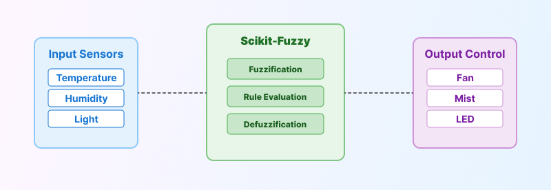
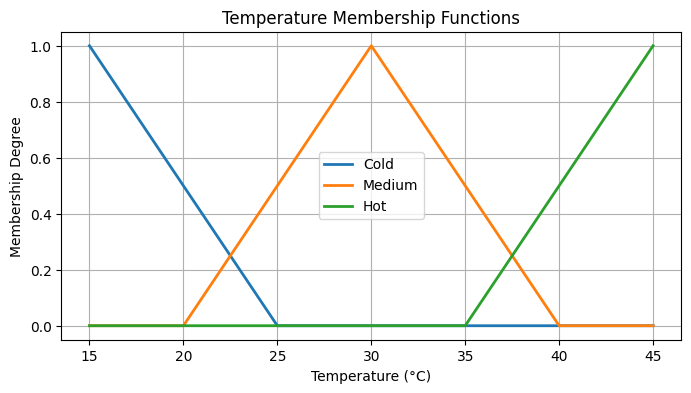
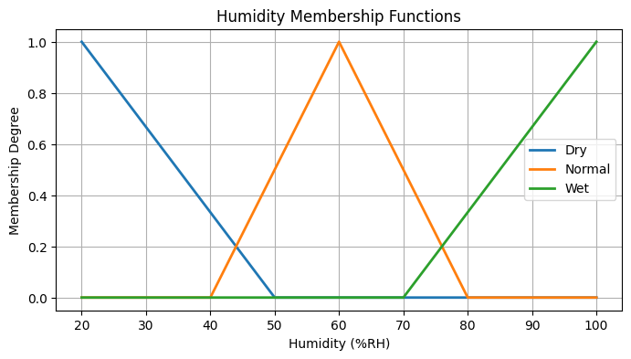
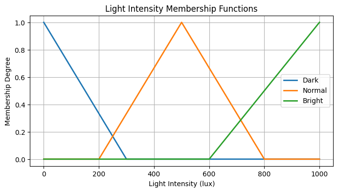
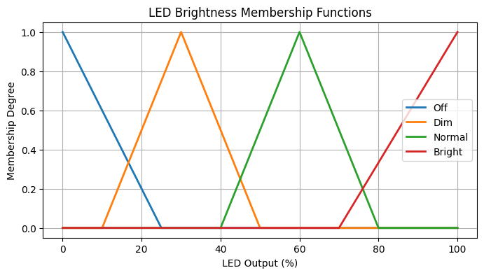

# 📘 [English version available here](README.en.md)

[](https://www.python.org/)
[](https://github.com/scikit-fuzzy/scikit-fuzzy)
[](https://github.com/morsetechlab)

# 🪴 ระบบควบคุมโรงเรือนอัจฉริยะด้วย Fuzzy Logic

> ระบบจำลองควบคุมพัดลม, พ่นหมอก, และแสงในโรงเรือนด้วย Fuzzy Logic พร้อมใช้งานแบบ CLI

ระบบควบคุมสภาพแวดล้อมในโรงเรือนแบบอัตโนมัติด้วยหลักการ Fuzzy Logic ควบคุมพัดลม ความชื้น และแสงสว่างแบบ Soft-Control ด้วย Python และ Scikit-Fuzzy เหมาะสำหรับงาน IoT, Smart Farming, ESP32 และ Raspberry Pi

## Key Features

- ใช้ `Python` + `scikit-fuzzy` ในการสร้างระบบตรรกะคลุมเครือ
- รองรับการเรียกใช้งานผ่าน CLI (`Command Line`)
- มีการประเมิน Input จริง: อุณหภูมิ, ความชื้น, ความสว่าง
- คืนค่าผลลัพธ์แบบ Soft-Control (%) ไม่ใช่เปิด-ปิดแบบแข็ง
- เหมาะสำหรับเชื่อมต่อกับ ESP32, Raspberry Pi, หรือ IoT Cloud

## System Overview

<p align="center">
  
</p>

> ระบบรับข้อมูลจากเซนเซอร์ (อุณหภูมิ, ความชื้น, แสง) ผ่าน Fuzzy Logic Controller และส่งค่าออกเป็นสัญญาณควบคุมพัดลม, พ่นหมอก, และ LED

## การติดตั้ง

```bash
pip install -r requirements.txt
```

หรือหากคุณยังไม่มีไฟล์ `requirements.txt` ให้ใช้:

```bash
pip install numpy scipy scikit-fuzzy packaging
```

## 🚀 การใช้งานผ่าน CLI

```bash
python fuzzy_greenhouse.py --temp 36.5 --hum 48 --light 120
```

#### ผลลัพธ์ที่ได้

```
Fuzzy Control Output:
Fan: 73.2 %
Mist: 51.8 %
LED: 93.6 %
```

### หากต้องการนำไปใช้งานเลยแบบ json

```bash
python fuzzy_greenhouse.py --temp 36.5 --hum 48 --light 120 --json
```

#### ผลลัพธ์แบบ Json

```
{
  "fan": 73.2,
  "mist": 51.8,
  "led": 93.6
}
```

## Membership Function (MF)

### 🌡️ Temperature

```python
Cold   = [15, 15, 25]
Medium = [20, 30, 40]
Hot    = [35, 45, 45]
```

<p align="center">
  
</p>

### 💧 Humidity

```python
Dry    = [20, 20, 50]
Normal = [40, 60, 80]
Wet    = [70, 100, 100]
```

<p align="center">
  
</p>

### 💡 Light

```python
Dark   = [0, 0, 300]
Normal = [200, 500, 800]
Bright = [600, 1000, 1000]
```

<p align="center">
  
</p>

### Fan / Mist / LED

```python
Off    = [0, 0, 25]
Low    = [10, 30, 50]
Medium = [40, 60, 80]
High   = [70, 100, 100]
```

<p align="center">
    
    
    
</p>


## Rule Base

ชุดกฎที่ใช้ในระบบควบคุม Fuzzy Logic นี้ครอบคลุมสถานการณ์ต่าง ๆ ที่อาจเกิดขึ้นในโรงเรือน

```text
# 🔥 กฎจากอุณหภูมิและความชื้น
IF Temp is Hot AND Hum is Dry         → Fan is High   AND Mist is High
IF Temp is Hot AND Hum is Normal      → Fan is High   AND Mist is Low
IF Temp is Hot AND Hum is Wet         → Fan is Medium AND Mist is Off

IF Temp is Medium AND Hum is Dry      → Fan is Medium AND Mist is Medium
IF Temp is Medium AND Hum is Normal   → Fan is Medium AND Mist is Low
IF Temp is Medium AND Hum is Wet      → Fan is Low    AND Mist is Off

IF Temp is Cold AND Hum is Dry        → Fan is Off    AND Mist is Low
IF Temp is Cold AND Hum is Normal     → Fan is Off    AND Mist is Off
IF Temp is Cold AND Hum is Wet        → Fan is Off    AND Mist is Off

# 💡 กฎจากแสง
IF Light is Dark                      → LED is Bright
IF Light is Normal                    → LED is Normal
IF Light is Bright                    → LED is Off

# 🧠 กฎผสมหลายปัจจัย
IF Temp is Hot AND Hum is Dry AND Light is Dark → Fan is High AND Mist is High AND LED is Bright

IF Temp is Medium AND Hum is Dry AND Light is Bright  → Fan is Medium AND Mist is Medium AND LED is Off

IF Temp is Cold AND Light is Dark → Fan is Off AND Mist is Off AND LED is Dim
```

> กฎเหล่านี้สามารถปรับแต่งเพิ่มเติมตามชนิดพืชหรือสภาพแวดล้อมที่ต้องการได้

## ตัวอย่างการนำไปใช้จริง

- ควบคุมพัดลมผ่าน `PWM`
- ควบคุม LED หรี่ไฟด้วย `DAC`
- ส่งค่าเซนเซอร์ผ่าน MQTT แล้วให้ระบบนี้ตัดสินใจที่ cloud หรือ edge

## Attribution

- Fuzzy Logic Framework [Scikit-Fuzzy](https://github.com/scikit-fuzzy/scikit-fuzzy)
- พัฒนาโดย [MorseTech Lab](https://github.com/morsetechlab)  

## 🛡️ License

โค้ดในโปรเจกต์นี้เผยแพร่ภายใต้เงื่อนไขของ [MIT License](./LICENSE)
คุณสามารถนำไปใช้ ดัดแปลง แจกจ่าย หรือใช้งานเชิงพาณิชย์ได้  
โดยต้องแสดงเครดิตและไม่รับประกันความเสียหายใด ๆ ที่อาจเกิดขึ้นจากการใช้งาน

**Academic Keywords**: Fuzzy Inference System, Rule-Based Controller, Soft Control, Environmental Monitoring, Greenhouse Automation, Embedded AI, Sensor-Driven Decision Making, Intelligent Control System

<!--
tags: Fuzzy Logic, Greenhouse Controller, Smart Farming, Automatic Climate Control, Python, Scikit-Fuzzy, IoT, ESP32, Raspberry Pi, Soft-Control System, Fan Control, Mist Control, LED Brightness, Fuzzy Inference System, Agricultural Automation, Edge AI
-->

<!-- Open Graph / Twitter Meta สำหรับ Fuzzy Greenhouse -->
<!--
<meta property="og:title" content="Fuzzy Greenhouse Controller – ระบบควบคุมโรงเรือนอัจฉริยะด้วย Fuzzy Logic" />
<meta property="og:description" content="ควบคุมพัดลม พ่นหมอก และแสงด้วยตรรกะฟัซซี่แบบ Soft-Control พร้อมกราฟ MF และ CLI ใช้งานจริงได้ใน IoT และ Smart Farming" />
<meta property="og:image" content="https://raw.githubusercontent.com/morsetechlab/fuzzy-greenhouse/main/images/og-fuzzy-greenhouse.png" />
<meta property="og:url" content="https://github.com/morsetechlab/fuzzy-greenhouse" />
<meta property="og:type" content="website" />

<meta name="twitter:card" content="summary_large_image" />
<meta name="twitter:title" content="Fuzzy Greenhouse Controller – ระบบควบคุมฟัซซี่สำหรับโรงเรือน" />
<meta name="twitter:description" content="ควบคุม Fan, Mist, LED อัตโนมัติด้วย Python + scikit-fuzzy พร้อมใช้งานบน Raspberry Pi หรือ ESP32." />
<meta name="twitter:image" content="https://raw.githubusercontent.com/morsetechlab/fuzzy-greenhouse/main/images/og-fuzzy-greenhouse.png" />
-->
